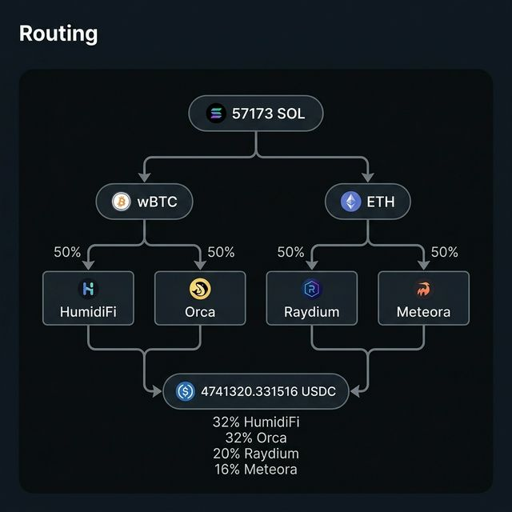
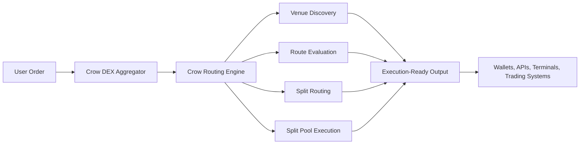
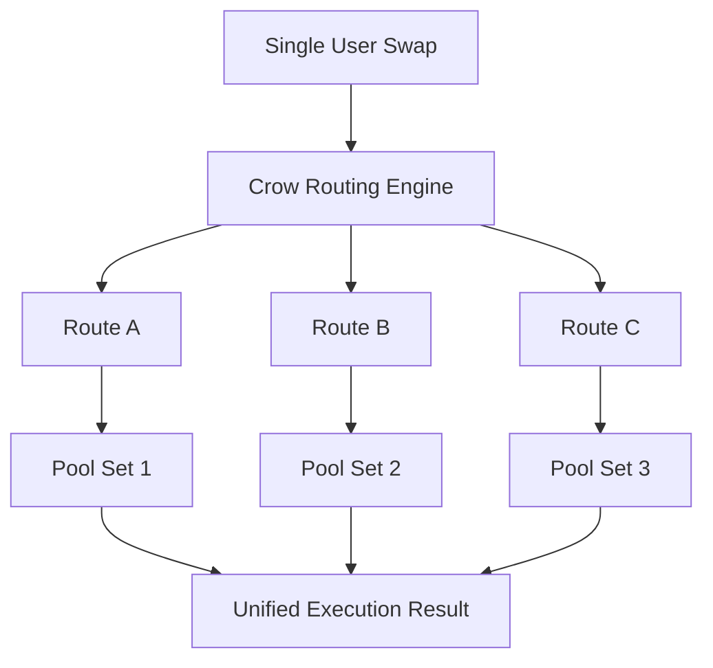

<div align="center">
  
  <h1>Crow DEX Aggregator</h1>
  <p><strong>A premium liquidity routing and aggregation layer for modern onchain trading</strong></p>
  <p>Powered by the Crow Routing Engine</p>
  <p>
    <a href="https://github.com/xkartee-bcdev/crow-dex-aggregator/issues"></a>
    <a href="https://github.com/xkartee-bcdev/crow-dex-aggregator/pulls"></a>
    <a href="https://github.com/xkartee-bcdev/crow-dex-aggregator/stargazers"></a>
  </p>
</div>

---

Crow DEX Aggregator is built to turn fragmented decentralized liquidity into a fast, clear, and execution-ready trading layer.

Instead of forcing users or integrators to think venue by venue, pool by pool, or market by market, Crow presents a unified routing surface that helps products access better execution across a fragmented onchain landscape.

## Overview

The Crow Routing Engine is the core intelligence layer behind the aggregator. It is designed to evaluate liquidity across multiple venues, compare route quality in real time, and produce execution-ready routing decisions for serious trading products.

Crow is built for teams that care about:

- Better execution quality
- Cleaner access to fragmented liquidity
- Lower integration overhead
- Real-time responsiveness to market conditions
- Professional-grade routing infrastructure

## What Crow Does

Crow DEX Aggregator provides a unified liquidity routing layer that can:

- Aggregate liquidity across multiple decentralized exchanges
- Evaluate routes across different venue and pool structures
- Surface execution-ready routing outcomes in real time
- Support split routing across multiple route branches
- Support split pool execution across multiple liquidity sources
- Adapt route selection as liquidity, pricing, and venue conditions change
- Serve as a routing foundation for wallets, terminals, APIs, and internal execution systems

## The Crow Routing Engine

The Crow Routing Engine is the public-facing execution intelligence layer behind the aggregator. Without exposing proprietary strategy details, its role can be described clearly:

- It observes fragmented liquidity as a single routing problem
- It compares multiple path candidates instead of relying on a single obvious venue
- It can distribute flow across more than one route when that improves the final execution profile
- It can distribute flow across more than one pool when a single pool is not the optimal destination for the full trade size
- It is built to produce routing decisions that are practical for real trading systems, not just theoretical best-price snapshots

This means Crow is not simply a price lookup tool. It is an execution-oriented routing layer designed to help products move from discovery to usable output with less manual logic sitting on top.

## Key Capabilities

### Multi-DEX Liquidity Aggregation

Crow combines liquidity from multiple trading venues into one routing surface, helping integrators access broader market depth without building one-off logic for every source independently.

### Smart Route Discovery

Crow evaluates multiple candidate paths and selects routes based on overall execution quality. The goal is not just to show a number, but to find routes that make sense under live market conditions.

### Split Routing

Crow can split a single order across multiple route branches when a single route is not the strongest way to execute the full size. This helps the aggregator make better use of fragmented liquidity across venues and route paths.

### Split Pool Execution

Crow can also split flow across multiple pools when concentrating the full order in one pool is not ideal. This allows the engine to better utilize available depth while keeping execution quality front and center.

### Real-Time Market Awareness

Crow is designed for live environments where liquidity, pricing, and route quality can change quickly. The routing layer is built to respond to those changing conditions instead of assuming a static market.

### Execution-Ready Output

Crow is designed around usable outcomes. The routing layer is intended to feed real products and execution systems that care about reliability, clarity, and speed.

### Integrator-Friendly Infrastructure

Crow can act as the routing backbone for:

- Wallet swap interfaces
- Trading terminals
- Aggregation APIs
- DeFi infrastructure products
- Internal execution systems
- Professional trading tools

## Capability Snapshot

| Area | Crow DEX Aggregator |
| --- | --- |
| Liquidity coverage | Multi-venue aggregation across fragmented markets |
| Routing model | Multi-path route evaluation |
| Split routing | Supported |
| Split pool execution | Supported |
| Market behavior | Real-time route responsiveness |
| Product focus | Execution-ready routing infrastructure |
| Integration profile | Suitable for wallets, APIs, terminals, and internal systems |

## Routing Example

The example below illustrates how Crow can represent a complex route as a clear execution plan. A single swap can branch across multiple assets, venues, and pool destinations, then converge into one final execution outcome.

<div align="center">
  
</div>

## Visual Overview



## Split Routing Representation



## Quote API Example

The following shows an example `GET /quote` request and a sample `200` response payload shape.

```bash
curl --request GET \
  --url 'http://0.0.0.0:8080/quote?slippageBps=50&swapMode=ExactIn&restrictIntermediateTokens=true&maxAccounts=64&instructionVersion=V1'
```

```json
{
  "inputMint": "<string>",
  "inAmount": "<string>",
  "outputMint": "<string>",
  "outAmount": "<string>",
  "otherAmountThreshold": "<string>",
  "swapMode": "ExactIn",
  "slippageBps": 1,
  "priceImpactPct": "<string>",
  "routePlan": [
    {
      "swapInfo": {
        "ammKey": "<string>",
        "inputMint": "<string>",
        "outputMint": "<string>",
        "inAmount": "<string>",
        "outAmount": "<string>",
        "label": "<string>",
        "outAmountAfterSlippage": "<string>"
      },
      "percent": 123,
      "bps": 123
    }
  ],
  "instructionVersion": "V1",
  "platformFee": {
    "amount": "<string>",
    "feeBps": 123
  },
  "contextSlot": 123,
  "timeTaken": 123,
  "additionalIntermediateTokens": [
    "<string>"
  ]
}
```

## How To Think About Crow

Crow should be thought of as a serious aggregation and routing layer, not merely a venue directory.

It is built to answer a more important question than "where is liquidity?" The real question is "how should liquidity be used to achieve a stronger execution result?" Crow exists to answer that at product scale.

## Use Cases

- Wallet swap routing
- Trading terminals
- Aggregation APIs
- Order flow optimization
- DeFi infrastructure products
- Internal trading systems
- Strategy and execution platforms

## Product Direction

Crow is being shaped around a clear long-term direction:

- Broader venue coverage
- Stronger route quality
- More expressive routing behavior
- Lower integration overhead
- Better developer ergonomics
- More dependable execution outcomes

## Brand Visuals

Crow now includes its core public brand assets directly in the repository.

<div align="center">
  
  
</div>

## Public Positioning

Crow is the public-facing identity of the platform.

This repository intentionally focuses on what the product does, what capabilities it offers, and how it can be understood by integrators and users. Proprietary algorithm details, internal optimization methods, and private execution logic are intentionally not described here.

---

<div align="center">
  <i>Crow DEX Aggregator is built to make decentralized liquidity feel unified, usable, and execution-ready.</i>
</div>
